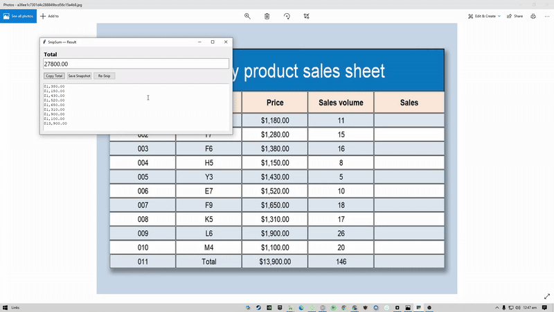

# SnipSum — OCR Snipping Tool for Instant Totals

A tiny, **pure-Python** desktop tool that lets you drag a rectangle on your screen (like Snipping Tool), runs OCR on the selection, **extracts all numbers**, treats values in **parentheses as negative** (accounting style), and pops up a **clean result window** with the **total** and the list of parsed numbers.

> **Why?** Manually adding amounts from tables, invoices, dashboards, or web apps is slow and error-prone. SnipSum makes it one drag-and-copy.

---

## Table of Contents

- [Demo](#demo)
- [Features](#features)
- [Tech Stack](#tech-stack)
- [Folder Structure](#folder-structure)
- [Quick Start](#quick-start)
  - [1) Install Python packages](#1-install-python-packages)
  - [2) Install Tesseract OCR (system)](#2-install-tesseract-ocr-system)
  - [3) Run](#3-run)
- [Usage](#usage)
- [How It Works](#how-it-works)
- [Configuration & Customization](#configuration--customization)
- [Troubleshooting](#troubleshooting)
- [Tests](#tests)
- [Packaging (Optional)](#packaging-optional)
- [Roadmap](#roadmap)
- [Security & Privacy](#security--privacy)
- [Contributing](#contributing)
- [License](#license)
- [Credits](#credits)
- [Why I built this](#why-i-built-this)

---

## Demo

> _Add your GIF or screenshot here_

```
docs/
  demo.gif
```

Embed in Markdown:

```md

```

---

## Features

- 🖼️ **Snip like a pro:** full-screen overlay; drag to select any region.
- 🔎 **OCR on device:** uses Tesseract OCR via `pytesseract` (no internet required).
- ➕ **Smart parsing:** handles `1,234.56`, `1.234,56`, `$120.00`, `(45.67)`, and `120-` (trailing minus).
- 🧮 **Accounting aware:** parentheses → negative values.
- 📋 **Copy friendly:** copy the total; inspect parsed numbers + their raw tokens.
- 🔐 **Private by design:** processing is 100% local.
- 🪟 **Beginner-friendly code:** small, modular files you can read in one sitting.

---

## Tech Stack

- **GUI:** Tkinter (Python standard library)
- **Screen capture:** [`mss`](https://github.com/BoboTiG/python-mss)
- **Images:** Pillow (PIL)
- **OCR:** Tesseract via `pytesseract`  
  _(Optional swap: EasyOCR for a pure-pip OCR with no system EXE)_

---

## Folder Structure

```
snipsum_py/
├─ app.py                 # Entry point & glue
├─ ui.py                  # Overlay snipper + results window (Tkinter + MSS + PIL)
├─ ocr.py                 # OCR helpers (Tesseract; lightweight preprocessing)
├─ parse.py               # Number extraction & summing (Decimal-based)
├─ requirements.txt
└─ tests/
   └─ test_parse.py       # A few sanity tests for the parser
```

---

## Quick Start

### 1) Install Python packages

```bash
pip install -r requirements.txt
```

`requirements.txt`:

```
mss
pillow
pytesseract
```

### 2) Install Tesseract OCR (system)

- **Windows:**
  - Install the 64-bit build (commonly “UB Mannheim” build).
  - Default path: `C:\Program Files\Tesseract-OCR\tesseract.exe`
  - You can skip editing PATH; SnipSum tries common paths and also allows hard-coding.

- **macOS (Homebrew):**
  ```bash
  brew install tesseract
  ```

- **Ubuntu/Debian:**
  ```bash
  sudo apt-get update
  sudo apt-get install tesseract-ocr
  ```

> **Verify (optional):**
>
> ```bash
> tesseract -v
> ```
> or in Python:
> ```python
> import pytesseract; print(pytesseract.get_tesseract_version())
> ```

### 3) Run

```bash
python app.py
```

- Your screen will dim; drag to select a region.  
- Release the mouse → a small window appears with the **total** and parsed numbers.  
- Buttons: **Copy Total**, **Save Snapshot**, **Re-Snip**.

---

## Usage

- **Cancel snip:** Press `Esc` while the overlay is active.
- **Re-Snip:** Use the “Re-Snip” button on the result window.
- **Save snapshot:** Saves your cropped selection as a PNG file.

---

## How It Works

1. **Overlay & Capture** (`ui.py`)  
   Full-screen Tkinter window shows a screenshot via `mss`. Drag a rectangle → crop to a PIL image.

2. **OCR** (`ocr.py`)  
   Light preprocessing (grayscale + autocontrast). `pytesseract` runs with a **character whitelist** optimized for numeric/currency characters.

3. **Parsing & Sum** (`parse.py`)  
   - Regex finds numeric tokens (supports thousands/decimal separators, currencies, parentheses, trailing minus).  
   - Detects decimal separator via the **rightmost-separator heuristic** (EU formats handled).  
   - Converts using `decimal.Decimal` (avoids float rounding errors).  
   - Returns a **total** and the list of `(Decimal value, raw_token)`.

---

## Configuration & Customization

- **Tesseract path (Windows):**  
  Auto-detection tries common install paths. If needed, set explicitly in `ocr.py`:

  ```python
  import pytesseract
  pytesseract.pytesseract.tesseract_cmd = r"C:\Program Files\Tesseract-OCR\tesseract.exe"
  ```

- **Character whitelist:** tweak for your data:

  ```python
  # ocr.py
  WHITELIST = "0123456789.,-()$€£₹% RsPKR"
  ```

- **Ignore percentages:**  
  The parser skips tokens ending with `%`. To include them, adjust the `PCT` regex logic in `parse.py`.

- **Parentheses as negative:**  
  Implemented in `_to_decimal()` in `parse.py`. Change the rule if your workflow differs.

---

## Troubleshooting

### `pytesseract.pytesseract.TesseractNotFoundError`
- Ensure Tesseract is installed (see above).
- On Windows, verify the path:
  ```
  "C:\Program Files\Tesseract-OCR\tesseract.exe" -v
  ```
- Set `pytesseract.pytesseract.tesseract_cmd` to that path in `ocr.py`.

### Blurry OCR / Low accuracy
- Zoom your source (e.g., browser zoom 125–150%) before snipping.
- Increase font size if possible.
- Keep the selection tight around the numbers to reduce noise.

### EU formats not summed correctly
- The parser infers decimal separator from tokens. If sources are **mixed** (`,` and `.` used inconsistently), normalize the source or adjust `_decide_decimal_sep()`.

### Multiple monitors / High DPI
- `mss` captures the **virtual screen** (all monitors). If coordinates seem off with unusual DPI scaling, try 100–150% OS scaling.

---

## Tests

```bash
pip install pytest
pytest -q
```

`tests/test_parse.py` includes:

- Parentheses → negative
- EU decimal comma support
- Date-like strings ignored

Add more tests as you encounter new formats.

---

## Packaging (Optional)

Create a standalone Windows EXE:

```bash
pip install pyinstaller
pyinstaller --noconsole --onefile --name SnipSum app.py
```

> **Note:** Tesseract remains an external dependency; your EXE still requires Tesseract installed on the target machine.

---

## Roadmap

- **v1.1 (Python-only)**
  - Global hotkey to launch/re-launch snipper.
  - Include/exclude checkboxes for individual values.
  - CSV export (numbers + raw token).
  - Session history with thumbnails.
  - Optional **EasyOCR** backend (pure-pip; no system Tesseract).

- **v2 (ideas)**
  - Column-mode (sum a visually aligned column).
  - Currency-only filter & per-currency totals.
  - Regex presets (include/exclude patterns).
  - PDF/image file import (no snip required).

---

## Security & Privacy

- All processing happens **locally** on your machine.
- No data is sent anywhere by default.
- A snapshot is saved **only** if you click **Save Snapshot**.

---

## Contributing

Pull requests welcome! Good first issues:

- Add a global hotkey launcher.
- Add a “Copy CSV” button with value + raw token.
- Toggle “ignore percentages” in the UI.
- Improve EU format detection heuristics.
- Add column-mode.

---

## License

This project is licensed under the **MIT License**.  
Create a `LICENSE` file with:

```
MIT License

Copyright (c) 2025 Muhammad Ibrahim

Permission is hereby granted, free of charge, to any person obtaining a copy...
```


---

## Credits

- [Tesseract OCR](https://github.com/tesseract-ocr/tesseract)
- [pytesseract](https://github.com/madmaze/pytesseract)
- [Pillow](https://python-pillow.org/)
- [python-mss](https://github.com/BoboTiG/python-mss)
- Tkinter (Python standard library)

---

## Why I built this

> At a previous job, I had to total many order amounts by hand from screenshots and web pages. It was slow and error-prone. **SnipSum** scratches that itch: select an area on screen, and it instantly totals all the amounts—treating accounting parentheses as negatives. It’s a beginner-friendly, pure-Python desktop app you can clone, read, and improve in an afternoon.
